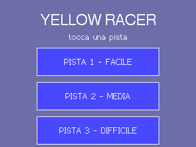
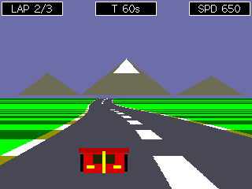
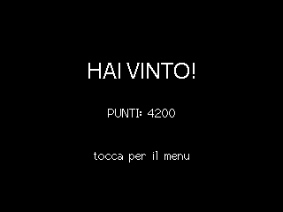
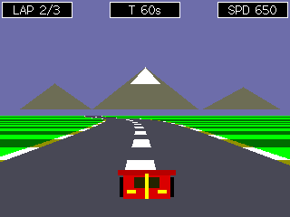

# 🏁 Yellow Racer

A **pseudo-3D** racing game (in the style of *Pole Position*) for the
**ESP32-2432S028R** board — the popular *"Cheap Yellow Display"* (CYD) with a
2.8" 320×240 LCD and a resistive touchscreen.

Written in C++ with the Arduino framework, built with PlatformIO. The graphics
engine is a projected-segment renderer (curves + hills) with an 8-bit sprite
double-buffer to avoid flicker.





### In action



## ✨ Features

- Pseudo-3D projected-segment renderer (Jake Gordon style) with **curves** and
  **hills** (up/down).
- Alternating red/white rumble strips, dashed center line, sky and a Mount Fuji
  silhouette with snow.
- **Double-buffer** on an 8-bit (RGB332) sprite in RAM: no flicker/ghosting.
- **Centrifugal force**: in corners the car is pushed outward, so you must steer.
- **Off-road**: leave the rumble strips and the grass slows you down.
- 3 tracks (easy / medium / hard) with different curves and hills.
- Time attack over **3 laps** with a time budget; score = remaining time × 100.
- Menu → Race → Game Over FSM, all driven by touch.
- HUD: current lap, time left, speed; a "GIRO n!" (lap) flash on each pass.
- ~25 stable FPS on hardware with no PSRAM.

## 🎮 Controls

- **Menu**: tap one of the 3 tracks to start.
- **Race**:
  - Tap the **left half** of the screen → steer left.
  - Tap the **right half** → steer right.
  - The car accelerates automatically. There is no auto-recentering: hold to
    steer, release to keep your line (centrifugal force will do the rest).
- **Game Over**: tap to return to the menu.

## 🔧 Hardware

- **Board**: ESP32-2432S028R (CYD) — ESP32 + 2.8" ILI9341 320×240 LCD + XPT2046 touch.
- No soldering required: display and touch are already on-board.
- Powered and flashed over USB (CH340).

Pinout (configured in [`src/User_Setup.h`](src/User_Setup.h) and
[`src/config.hpp`](src/config.hpp)):

| Function | Pin |
|----------|-----|
| TFT_DC / CS / SCK / MOSI / MISO | 2 / 15 / 14 / 13 / 12 |
| TFT_BL (backlight) | 21 |
| Touch XPT2046 CLK / MOSI / MISO / CS / IRQ | 25 / 32 / 39 / 33 / 36 |

> The touch uses a **separate** SPI bus from the display (VSPI remapped to pins 25/32/33/36/39).

## 🛠️ Build & Flash

Requirements: [PlatformIO Core](https://platformio.org/) (`pip install platformio`).

```bash
# build
pio run

# flash (board connected on /dev/ttyUSB0)
pio run -t upload

# serial monitor (115200) — requires a TTY terminal
pio device monitor
```

If the upload fails with "port busy", close any open serial monitor or lower the
upload speed in [`platformio.ini`](platformio.ini).

## 📁 Project structure

```
├── platformio.ini         # environment config + libraries
├── PIANO_SVILUPPO.md      # development plan (M1-M4) with technical notes
├── README.md
├── docs/                  # screenshots
│   ├── menu.png
│   ├── race.png
│   └── gameover.png
├── tools/
│   ├── capture.py         # capture screenshots over serial
│   └── capture_gif.py     # capture a gameplay GIF over serial
└── src/
    ├── User_Setup.h       # TFT_eSPI config (ILI9341 driver, CYD pins)
    ├── config.hpp         # touch pins, palette, game constants
    ├── input.hpp/.cpp     # XPT2046 (dedicated SPI) + calibration
    ├── track_data.hpp     # Segment struct + 3 TrackDefs + buildTrack()
    ├── renderer.hpp/.cpp  # pseudo-3D segments + 8-bit sprite double-buffer
    ├── game.hpp/.cpp      # Menu/Race/GameOver FSM, steering, laps, time, HUD
    └── main.cpp           # entry point + loop
```

## 🖼️ Capturing screenshots (dev)

The firmware exposes a serial command: sending the character **`s`** (at 115200
baud) composes 3 scenes (menu/race/gameover) and dumps their 8-bit framebuffer
(RGB332, 320×240, stride 320) marked with `SHOT:<name>\n`. The script
[`tools/capture.py`](tools/capture.py) sends the command and saves PNGs to
`docs/`:

```bash
python3 tools/capture.py   # requires pyserial + Pillow
```

To generate an **animated GIF** of the race (60 frames at gameplay speed):

```bash
python3 tools/capture_gif.py   # uses 921600 baud; saved to docs/race.gif
```

> Note: `capture_gif.py` opens the serial port at 921600 baud. To capture at
> that speed the firmware must be temporarily recompiled with
> `Serial.begin(921600)` in `src/main.cpp` (then reverted). The script is
> provided as a reference; ready-made GIFs are in `docs/`.

## 🧠 Technical notes

- **No PSRAM** on the CYD: no 16-bit framebuffer (320×240×2 = 154 KB doesn't fit
  in the largest contiguous heap block, ~108 KB). An **8-bit sprite** (77 KB) is
  used as a double-buffer; RGB565 colors are quantized to RGB332.
- **Exact tiling** between segments (`lroundf` on bit-identical edges): zero gaps
  (no ghosting) and zero overdraw.
- The **resistive** XPT2046 touch uses the global `SPI` (VSPI) remapped to the
  touch pins *before* `ts.begin()`: this is because `SPIClass::begin()` is a
  no-op if the bus is already started (see [`PIANO_SVILUPPO.md`](PIANO_SVILUPPO.md)).

## 🗺️ Status & roadmap

- ✅ **M1** Initialization (display, touch, build).
- ✅ **M2** 2.5D graphics engine (segments, curves, hills, double-buffer).
- ✅ **M3** Game logic (FSM, steering, centrifugal force, laps, time, 3 tracks).
- ⬜ **M4** (optional) Optimization: 16-bit DMA push (two 320×120 sprites), fine
  touch calibration, bitmap assets, audio (speaker on IO26).

Details in [`PIANO_SVILUPPO.md`](PIANO_SVILUPPO.md).

## 🙏 Credits

- Pseudo-3D algorithm inspired by [Jake Gordon — "Making a racing game"](https://github.com/jakesgordon/javascript-racer).
- The [ESP32-Cheap-Yellow-Display](https://github.com/witnessmenow/ESP32-Cheap-Yellow-Display) community (CYD pinout and docs).
- [TFT_eSPI](https://github.com/Bodmer/TFT_eSPI) by Bodmer for the display.
- [XPT2046_Touchscreen](https://github.com/PaulStoffregen/XPT2046_Touchscreen) by Paul Stoffregen for the touch.

## 📄 License

MIT — see [`LICENSE`](LICENSE). Third-party libraries retain their respective licenses.
